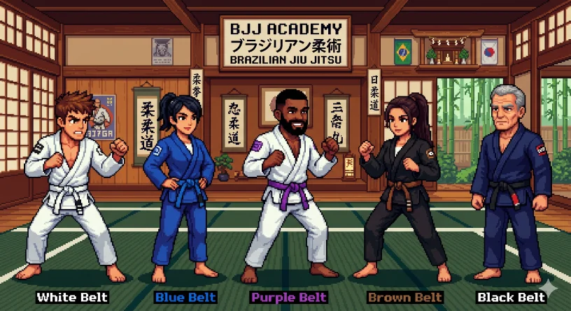

<p align="center">
  
</p>

<h1 align="center">Mission Control</h1>

<p align="center">
  <strong>AI crew command center for BJJ Lotus Club</strong>
</p>

<p align="center">
  <a href="#features">Features</a> •
  <a href="#getting-started">Getting Started</a> •
  <a href="#architecture">Architecture</a> •
  <a href="#api">API</a> •
  <a href="#deployment">Deployment</a> •
  <a href="#built-with">Built With</a>
</p>

<p align="center">
  
  
  
  
  
</p>

---

**Mission Control** is a full-stack operations dashboard for the **BJJ Lotus Club** — an always-on AI crew that autonomously creates content, code, and products for the BJJ community. It tracks projects, manages tasks, stores memory, and orchestrates autonomous agents.

👉 **Live demo:** [office.kaioandrade.com](https://office.kaioandrade.com)

---

## Features

### 📊 Dashboard
Real-time overview of everything happening in your crew. Stats grid (projects, tasks, memory, docs, activity, crew), embedded activity feed, crew status, and quick actions.

### 📋 Projects
Full CRUD with belt-colored cards (white → blue → purple → brown → black in rotation). Create, edit, and delete projects with description, mission statement, status, and progress tracking. Persisted as JSON on disk.

### ✅ Tasks
Manage your crew's pipeline. Create tasks with status (pending / in-progress / done) and priority. Toggle completion with checkboxes, delete with one click, search by title or project. Stored in `data/tasks.json`.

### ✍️ Content
Write and organize documents by category (newsletter, video script, course). Full markdown editor with persistence to `docs/` directory on disk.

### 🧠 Memory
Browse daily logs with word counts, line counts, and full content viewer. Click any entry to read the complete daily log. Search by title or content preview.

### 📄 Docs
Browse all agent-written documents in a grid view. Click to read full content. Search by title or file path.

### 📋 Activity Feed
Complete operation log — every task created or completed, every document written, every system event. Filter by type (system, created, done, updated). Timestamps with relative time ("5m ago").

### 🛸 Team & Visual
Crew roster auto-read from agent configs. Pixel art gallery featuring the BJJ Belt Lineup — the app's custom SVG identity.

### 🤖 Agent Orchestration (Phase 2)
Three autonomous cron jobs that make the crew work without supervision:

| Job | Schedule | What It Does |
|-----|----------|-------------|
| **Crew Cycle** | Every 4h | Reads projects/tasks/memory, picks pending work, executes, logs results |
| **Task Scheduler** | Every 6h | Checks projects for gaps, creates next-step tasks automatically |
| **Memory Consolidation** | Daily @ 04:00 CEST | Curates daily logs into long-term memory |

---

## Getting Started

```bash
# Clone the repo
git clone https://github.com/kaioe/mission-control.git
cd mission-control

# Install dependencies
npm install

# Start development server
npm run dev

# Build for production
npm run build

# Start production server
npm start
```

The app runs on **http://localhost:3000** in development mode.

> **Note:** Some features read from `/root/.openclaw/workspace/` on disk. For standalone use, the API routes fall back gracefully when workspace directories aren't available.

---

## Architecture

```
mission-control/
├── src/
│   ├── app/
│   │   ├── api/          # REST API routes
│   │   │   ├── activity/ # Activity feed CRUD
│   │   │   ├── docs/     # Document listing & creation
│   │   │   ├── memories/ # Memory log reading
│   │   │   ├── projects/ # Project CRUD
│   │   │   ├── stats/    # Dashboard aggregation
│   │   │   └── tasks/    # Task CRUD with PATCH/status toggle
│   │   ├── activity/     # Activity feed page
│   │   ├── calendar/     # Month calendar view
│   │   ├── content/      # Document creation & editing
│   │   ├── dashboard/    # Main dashboard (homepage)
│   │   ├── docs/         # Document browser
│   │   ├── memory/       # Daily log browser
│   │   ├── projects/     # Project CRUD UI
│   │   ├── tasks/        # Task management
│   │   ├── team/         # Crew roster
│   │   └── visual/       # Asset gallery
│   ├── components/
│   │   ├── sidebar.tsx   # Navigation sidebar (11 tabs)
│   │   ├── toast.tsx     # Toast notification system
│   │   └── ui/           # shadcn/ui components
│   └── lib/
│       └── utils.ts      # Utility functions
├── data/
│   ├── activity.json     # Activity feed storage
│   └── tasks.json        # Task queue storage
├── public/
│   └── bjj-pixel-art.svg # Custom BJJ pixel art (favicon)
└── package.json
```

### Design System

- **Dark theme** — `#0A0A0F` background, `#141419` cards, `#F5F5F5` text
- **Purple accent** — `#9333EA` primary, `#2563EB` secondary
- **Belt colors** — White, Blue, Purple, Brown, Black throughout the UI
- **Pixel art** — Custom SVG with `shape-rendering: crispEdges`
- **Typography** — Geist (Vercel's font family), monospace for code/pre blocks

---

## API

All API routes return JSON. The app uses Next.js Route Handlers (App Router).

| Method | Endpoint | Description |
|--------|----------|-------------|
| `GET` | `/api/stats` | Aggregated dashboard statistics |
| `GET` | `/api/projects` | List all projects |
| `PUT` | `/api/projects/[id]` | Create or update a project |
| `DELETE` | `/api/projects/[id]` | Delete a project |
| `GET` | `/api/tasks` | List all tasks |
| `POST` | `/api/tasks` | Create a new task |
| `PATCH` | `/api/tasks/[id]` | Update task (status toggle, etc.) |
| `DELETE` | `/api/tasks/[id]` | Delete a task |
| `GET` | `/api/memories` | List all memory entries |
| `GET` | `/api/memories/[id]` | Get full memory content |
| `GET` | `/api/docs` | List all documents with content |
| `POST` | `/api/docs` | Create a new document |
| `GET` | `/api/activity` | Get activity feed (limit param) |
| `POST` | `/api/activity` | Log a new activity event |

---

## Deployment

### Option 1: Direct (Node.js)

```bash
npm run build
npm start -- -p 3000
```

### Option 2: Reverse Proxy (Caddy)

```caddyfile
office.example.com {
    reverse_proxy 127.0.0.1:3000
}
```

### Option 3: Docker (coming soon)

---

## Built With

- **[Next.js 16.2.6](https://nextjs.org/)** — React framework with App Router
- **[React 19.2.4](https://react.dev/)** — UI library
- **[Tailwind CSS 4](https://tailwindcss.com/)** — Utility-first CSS
- **[shadcn/ui](https://ui.shadcn.com/)** — Component library
- **[Base UI](https://base-ui.com/)** — Accessible UI primitives
- **[Lucide](https://lucide.dev/)** — Icons
- **[Caddy](https://caddyserver.com/)** — Reverse proxy with auto HTTPS

---

## License

MIT © [kaioe](https://github.com/kaioe)

---

<p align="center">
  <sub>Built by <a href="https://github.com/kaioe">Kaio Andrade</a> and the BJJ Lotus Club AI crew.</sub>
</p>
<p align="center">
  <sub>👻 Oss — Chief of Staff</sub>
</p>
